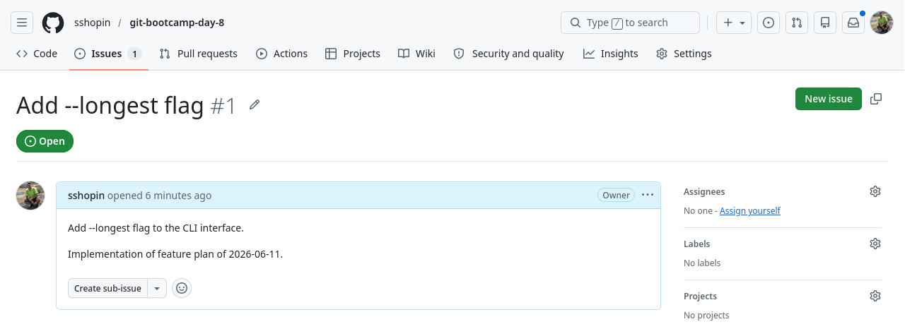
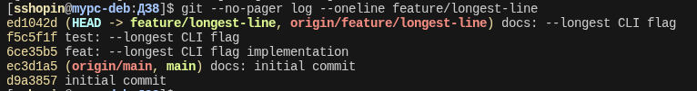
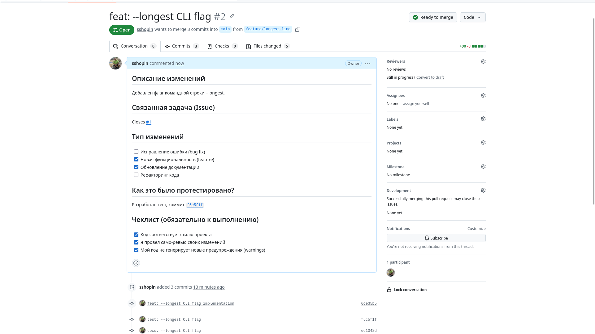
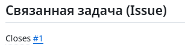

# LAB — день 8

> Скопируйте в `LAB.md` в корне `git-bootcamp-day-8` на **GitHub** и заполните по ходу работы.

## Базовая задача — `01-pr-and-review`

### Ссылки

| Что | URL |
|-----|-----|
| Репозиторий | https://github.com/sshopin/git-bootcamp-day-8 |
| Issue | https://github.com/sshopin/git-bootcamp-day-8/issues/1 |
| Pull Request | https://github.com/sshopin/git-bootcamp-day-8/pull/2 |

### Скриншоты (обязательные)

1. **Issue** — страница с текстом задачи:



2. **История feature-ветки** — `git log --oneline feature/ongest-line`, видны 3 CC-коммита:



3. **Pull Request** — заполненный template (Описание / Что меняется / Как проверять / Чек-лист):



4. **Привязка к Issue** — `Closes #N` в описании или блок Linked issues:



### Команды

```bash
# git switch -c feature/longest-line

# git add cmd/wordcount/main.go internal/stats/longest.go
# git commit -m "feat: --longest implementation"

# git add internal/stats/longest_test.go
# git commit -m "test: --longest CLI flag"

# git add CHANGELOG.md README.md
# git commit -m "docs: --longest CLI flag"

# git push -u origin feature/longest-line
```

### Впечатления (2–3 предложения)

.github/PULL_REQUEST_TEMPLATE.md нужно добавлять в репозиторий.
Closes #1 с автоматической гиперссылкой
